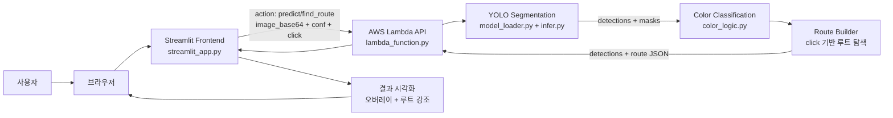
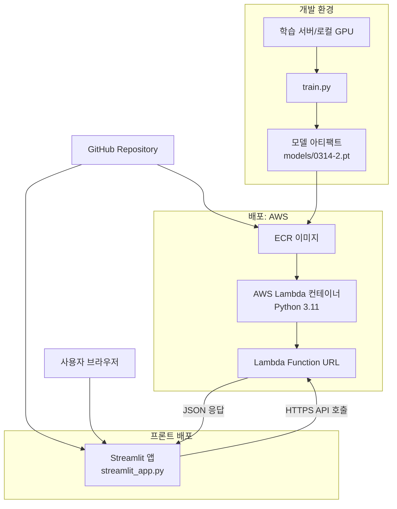

# RouteFinder
> 딥러닝 기반 클라이밍 홀드/테이프 인식 및 루트 찾기


## 개요
RouteFinder는 **Computer Vision + Deep Learning**으로 클라이밍 벽 이미지에서 홀드(및 테이프)를 세그멘테이션하고, 사용자가 클릭한 홀드를 기준으로 동일 색상 루트를 자동 추출하는 프로젝트입니다.

개발 포인트
- 세그멘테이션 기반 객체 인식 파이프라인 구축
- 조명 변화에 강인한 색상 분류(LAB + Retinex) 적용
- 추론 API(AWS Lambda)와 UI(Streamlit) 분리 배포
- 추론 결과를 사람 중심 인터랙션(클릭 기반 루트 탐색)으로 연결


## 데모
사용 흐름
1. 이미지 업로드
2. 홀드 탐지 실행
3. 이미지에서 특정 홀드 클릭
4. 선택한 홀드와 같은 색상의 루트 자동 시각화

이미지 자리: 데모 GIF/스크린샷

## 기능
- **홀드 세그멘테이션 추론**: YOLO 기반 모델로 홀드/테이프 검출
- **색상 분류**: Retinex 전처리 + LAB 범위 기반 색상 추정
- **클릭 기반 루트 탐색**: 선택 홀드와 동일 색상 홀드 군집 추출
- **테이프 보조 판단**: 인접 테이프 색과 위치 분포로 시작/종료 후보 추론
- **실시간 시각화**: 선택 루트만 컬러 강조, 나머지는 흑백 처리
- **서버-클라이언트 분리**: Lambda API와 Streamlit 프론트 분리 구성

이미지 자리: 기능 요약 다이어그램

## 아키텍처
구성 요소
- `train.py`: Ultralytics YOLO 학습 엔트리
- `model_loader.py`: 단일 모델 인스턴스 로딩(재사용)
- `infer.py`: 기본 추론/세그멘트 직렬화
- `color_logic.py`: Retinex + LAB 기반 색 분류
- `lambda_function.py`: API 핸들러(`predict`, `find_route`, `health`)
- `streamlit_app.py`: 사용자 인터페이스 및 인터랙션

데이터 플로우
1. Streamlit이 이미지를 base64로 인코딩 후 API 호출
2. Lambda가 이미지 디코딩 후 YOLO 추론 수행
3. 세그멘트/박스/클래스 + 색상 라벨 생성
4. `find_route` 요청 시 클릭 좌표 기준 루트 계산
5. 프론트에서 루트 강조 렌더링

아키텍처 의사결정 및 트레이드오프
- **YOLO 세그멘테이션 선택**
  - 장점: 객체 탐지 + 마스크를 단일 파이프라인으로 처리 가능
  - 트레이드오프: 초경량 모델 대비 추론 비용 증가 가능
- **Lambda 서버리스 배포**
  - 장점: 운영 부담이 낮고 API 엔드포인트 관리가 단순함
  - 트레이드오프: 콜드스타트/메모리 제약으로 지연 가능성 존재
- **LAB 규칙 기반 색 분류 병행**
  - 장점: 데이터가 제한된 환경에서도 안정적으로 색상 기준 제어 가능
  - 트레이드오프: 조명/카메라 도메인 변화가 크면 수동 튜닝 필요
- **프론트/백엔드 분리**
  - 장점: UI 실험과 추론 API를 독립적으로 개발/배포 가능
  - 트레이드오프: 네트워크 왕복 지연과 응답 파싱 복잡도 증가



## 데이터 전처리
- 이미지 디코딩 후 세그멘트 폴리곤을 마스크로 변환
- 색상 분류 전 Retinex(MSRCR 계열) 적용으로 조명 편차 완화
- LAB 색공간으로 변환 후 `lab_ranges.json` 기준 매칭
- 필요 시 마스크 내부 픽셀만 사용해 배경 간섭 최소화

의사결정 및 트레이드오프
- HSV 대신 LAB를 채택해 조명 변화 민감도를 낮췄지만,
  특정 체육관 조명에서는 범위 튜닝 작업이 추가로 필요합니다.

이미지 자리: 전처리 전/후 비교 이미지

## 모델
- 프레임워크: Ultralytics YOLO (Segmentation)
- 학습 스크립트: `train.py`
- 추론 로딩: `model_loader.py` (`models/0314-2.pt`)

학습 파라미터(현재 코드 기준)
- `epochs=100`
- `imgsz=780`
- `dropout=0.2`
- `device=0` (GPU 학습)


## 학습 평가

권장 평가 항목
- Detection/Segmentation: mAP@0.5, mAP@0.5:0.95
- 분류 보조 지표: 홀드 색상 분류 정확도
- 사용자 관점 지표: 클릭 기준 루트 추론 성공률
- 오류 분석: 조명 조건, 홀드 겹침, 테이프 누락 케이스

의사결정 및 트레이드오프
- 단순 mAP만으로는 실제 사용자 경험(루트 탐색 성공 여부)을 충분히 설명하기 어렵기 때문에,
  서비스 지표를 함께 관리하는 전략을 사용
- 클라이밍 홀드 분류 문제 특성상 false-negative를 최소화하는 것이 중요하다고 판단해 낮은 conf를 선택하는 것이 유리


## 배포
### 1) API 배포 (AWS Lambda)
- 컨테이너: `Dockerfile` (Python 3.11 Lambda 베이스)
- 핸들러: `lambda_function.lambda_handler`
- 주요 액션
  - `predict`: 홀드/테이프 검출 + 색상 주석
  - `find_route`: 클릭 좌표 기반 루트 계산
  - `health`: 상태 확인

### 2) 프론트 배포 (Streamlit)
- 엔트리: `streamlit_app.py`
- 환경변수: `ROUTE_FINDER_API_URL`
- 로컬 실행 예시
```bash
pip install -r requirements.txt
streamlit run streamlit_app.py
```

의사결정 및 트레이드오프
- Streamlit을 사용해 프로토타입 속도를 높였고,
  커스텀 UX 요구가 커질 경우 React/Next.js로 이관하는 확장 전략을 고려할 수 있습니다.



---

### 빠른 시작
```bash
# 1) 의존성 설치
pip install -r requirements_project.txt

# 2) 로컬 추론 테스트 (예시)
python request_test.py

# 3) 프론트 실행
streamlit run streamlit_app.py
```
